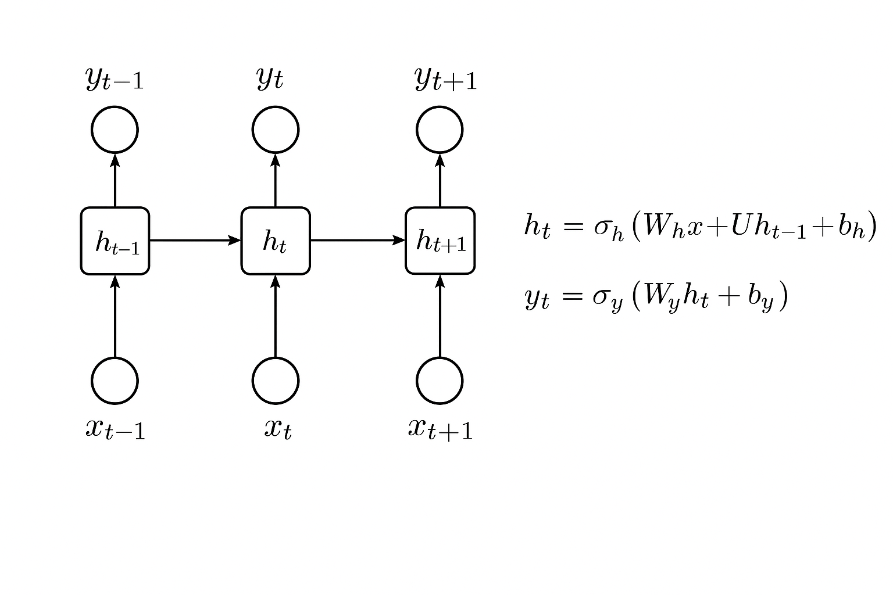

# 深度学习

## 一、神经网络基础

神经网络是深度学习的基石，让我们从基础的感知机开始。

!!!info "单层神经网络/感知机 (Perceptron)"
    感知机是最简单的神经网络，由输入层和输出层构成。

    *   **结构**：输入特征 $x_1, x_2, ..., x_n$ 经过加权求和，再通过一个激活函数（如阶跃函数）得到输出。
    *   **参数**：权重 (weights) $w_i$ 和偏置 (bias) $b$。
    *   **局限性**：单层感知机只能解决线性可分问题，例如无法解决XOR（异或）这样的简单非线性分类任务。

为了克服单层感知机的局限性，引入了多层感知机。

!!!success "多层神经网络/多层感知机 (MLP)"
    MLP通过在输入层和输出层之间增加一个或多个隐藏层 (Hidden Layer) 来解决非线性问题。

    *   **能力**：可以解决复杂分类任务，如XOR问题。
    *   **核心思想**：随着层数的增加，神经网络的学习能力越来越强，能完成更多更难的任务。每一层都可以看作是对前一层输出特征的进一步抽象和组合。

### 1. “神经元” (Neuron)

神经元是神经网络的基本计算单元。

*   **计算方式**：一个神经元的输出 $a$ (activation) 通常由其输入 $x_i$ 与对应的权重 $w_i$ 的加权和，再加上一个偏置 $b$，然后通过一个激活函数 $\sigma$ 计算得到。

    $z = \sum_i w_i x_i + b = \mathbf{w} \cdot \mathbf{x} + b$
    $a = \sigma(z)$

*   **神经网络参数**：主要包括每个神经元中的权重 $\mathbf{w}$ 和偏置 $b$。

### 2. 激活函数 (Activation Function)

激活函数为神经网络引入非线性，使其能够学习和表示更复杂的函数。

!!!tip "Sigmoid 函数"
    Sigmoid函数是早期常用的一种激活函数。

    *   **公式**：

        $\sigma(z) = \frac{1}{1 + e^{-z}}$

    *   **特性**：
        *   将输入值映射到 (0, 1) 区间，可以被解释为概率。
        *   在远离0的区域梯度趋近于0，可能导致梯度消失问题。
    
        *(示意图，PPT中包含此图)*

其他常用的激活函数还包括ReLU (Rectified Linear Unit), Tanh等。

### 3. 神经网络的结构与前向传播

一个典型的全连接神经网络（MLP）由输入层、若干隐藏层和输出层组成。

*   **输入层 (Input Layer)**：接收原始数据，例如图片的像素值，文本的词向量等。
*   **隐藏层 (Hidden Layers)**：进行特征提取和转换。每一层的输出作为下一层的输入。

    对于第 $l$ 层的第 $j$ 个神经元，其激活值 $a_j^{(l)}$ 计算如下：

    $z_j^{(l)} = \sum_i w_{ji}^{(l)} a_i^{(l-1)} + b_j^{(l)}$

    $a_j^{(l)} = \sigma(z_j^{(l)})$

    其中 $a_i^{(l-1)}$ 是第 $l-1$ 层神经元的激活值。

*   **输出层 (Output Layer)**：输出最终结果，例如分类的概率分布（使用Softmax激活函数）或回归值。

**矩阵表示**：

若第 $l-1$ 层的激活输出为向量 $\mathbf{a}^{(l-1)}$，第 $l$ 层的权重矩阵为 $\mathbf{W}^{(l)}$，偏置向量为 $\mathbf{b}^{(l)}$，则第 $l$ 层的输出 $\mathbf{a}^{(l)}$ 可以表示为：
$\mathbf{z}^{(l)} = \mathbf{W}^{(l)} \mathbf{a}^{(l-1)} + \mathbf{b}^{(l)}$
$\mathbf{a}^{(l)} = \sigma(\mathbf{z}^{(l)})$

这种从输入到输出的计算过程称为**前向传播 (Forward Propagation)**。神经网络可以看作是一个复杂的复合函数，输入一个向量，输出另一个向量。

!!!note "功能视角"
    从功能角度讲，神经网络可以看作是：
    **多层特征提取器 + 线性分类器/回归器**
    隐藏层自动学习和提取有用的特征，取代了传统机器学习中繁琐的特征工程。

## 二、深度学习 (Deep Learning)

!!!info "什么是“深度”?"
    “深度”指的是神经网络中包含**非常多的隐藏层**。

    随着层数的增加，神经网络的学习能力通常会更强，能够处理更复杂的任务。

### 1. 深度学习的演进

一些里程碑式的深度模型展示了层数增加带来的性能提升：

*   **AlexNet (2012)**: 8 layers, ImageNet 错误率 16.4%
*   **VGG (2014)**: 19 layers, ImageNet 错误率 7.3%
*   **GoogleNet (2014)**: 22 layers, ImageNet 错误率 6.7%
*   **ResNet (2015)**: 152 layers, ImageNet 错误率 3.57%

### 2. 深度学习的挑战：梯度消失 (Vanishing Gradient)

简单地堆叠层数并非万能。当网络非常深时，在反向传播更新参数的过程中，梯度可能会逐层递减。

*   **问题**：靠近输入层的低层网络参数更新缓慢，梯度呈现指数衰减，导致这些层基本上接收不到有效的训练信号。
*   **解决方案**：ResNet等架构通过引入残差连接等机制有效缓解了梯度消失问题。

深度学习不仅仅是堆叠层数，还需要针对不同类型的数据设计专门的网络结构：

*   **视觉数据**：CNN, ResNet, DenseNet, ...
*   **文本数据**：RNN, LSTM, Transformer, Bert, ChatGPT, ...
*   **其他数据**：AlphaFold (蛋白质结构预测)

### 3. 深度学习的先驱

2018年图灵奖授予了三位对深度学习做出开创性贡献的学者，他们在AI寒冬期坚持研究神经网络：

*   **Geoffrey Hinton**: 反向传播算法、玻尔兹曼机。
*   **Yann LeCun**: 卷积神经网络 (CNN)、改进反向传播。
*   **Yoshua Bengio**: 自然语言处理、注意力机制、生成模型。

## 三、卷积神经网络 (CNN / ConvNet)

CNN是处理网格状数据（如图像）非常有效的深度学习模型。

### 1. MLP处理图像的局限性

若直接将图像像素展平输入MLP：

*   **参数量巨大**：例如，一张100x100的彩色图片（3通道）就有30000个输入单元，若隐藏层有1000个神经元，则仅第一层就有3千万个权重参数。
*   **忽略图像结构特性**：MLP无法利用图像的空间局部性。

### 2. CNN的设计灵感：人类视觉系统特点

CNN的设计借鉴了人类视觉皮层处理信息的方式：

1.  **局部特征影响大 (Local Receptive Fields)**：识别一个物体（如鸟嘴）通常只需要关注图像的一小块局部区域。
2.  **重要位置常变化 (Translation Invariance / Parameter Sharing)**：一个特征（如鸟嘴）可能出现在图像的不同位置，但识别该特征的检测器应该是相同的。
3.  **采样压缩也没差 (Downsampling / Pooling)**：对图片进行适当的下采样（如缩小分辨率）通常不会改变我们对物体内容的识别，同时可以减少计算量。

### 3. CNN核心组件

#### a. 卷积层 (Convolutional Layer)

卷积层通过**卷积核 (Kernel / Filter)** 来提取局部特征。

*   **卷积核**：一个小型的权重矩阵，在输入数据上滑动（卷积操作），计算点积。
*   **局部连接**：卷积核只与输入数据的一个小区域（感受野）相连，提取该区域的特征。
*   **权重共享 (Parameter Sharing)**：同一个卷积核在整个输入图像上滑动，用相同的权重参数去检测不同位置的相同特征。这大大减少了模型参数量，并使模型具有平移不变性。
*   **特征图 (Feature Map)**：一个卷积核对输入进行卷积后生成的输出。每个特征图代表一种特定特征在图像中不同位置的激活强度。
    *(示意图：一个卷积核在图像上滑动生成特征图)*

**卷积操作参数**：

*   **步长 (Stride, $S$)**: 卷积核每次滑动的像素数。
*   **填充 (Padding, $P$)**: 在输入图像的边缘添加额外的像素（通常是0），以控制输出特征图的大小，并更好地处理边缘信息。

**特征图维度计算**：

假设输入图像尺寸为 $H_{in} \times W_{in} \times D_{in}$ (高 x 宽 x 深度/通道数)，卷积核尺寸为 $K_h \times K_w \times D_{in}$，步长为 $S$，填充为 $P$。

输出特征图的高度 $H_{out}$ 和宽度 $W_{out}$ 为：

$H_{out} = \lfloor \frac{H_{in} - K_h + 2P}{S} \rfloor + 1$

$W_{out} = \lfloor \frac{W_{in} - K_w + 2P}{S} \rfloor + 1$

输出特征图的深度 $D_{out}$ 等于所使用的卷积核的数量。每个卷积核产生一个特征图（一个通道）。

!!!warning "练习"
    假设输入图片为 $6 \times 6 \times 1$，卷积核为 $3 \times 3 \times 1$，步长 $S=1$，无填充 $P=0$。
    $H_{out} = (6 - 3 + 2*0)/1 + 1 = 4$
    $W_{out} = (6 - 3 + 2*0)/1 + 1 = 4$
    输出特征图尺寸为 $4 \times 4 \times 1$。

    如果步长 $S=2$：
    $H_{out} = (6 - 3 + 2*0)/2 + 1 = 1.5 + 1 = 2$ (向下取整)
    $W_{out} = (6 - 3 + 2*0)/2 + 1 = 1.5 + 1 = 2$
    输出特征图尺寸为 $2 \times 2 \times 1$。

#### b. 池化层 (Pooling Layer)

池化层通常在卷积层之后，用于对特征图进行下采样，以减少数据维度、减少计算量、增强模型的鲁棒性（对微小位移不敏感）。

*   **最大池化 (Max Pooling)**：在池化窗口内选取最大值作为输出。这是最常用的池化方式。
*   **平均池化 (Average Pooling)**：计算池化窗口内元素的平均值。

*(示意图：Max Pooling操作)*

Max pooling保留了最显著的特征，同时减小了特征图的尺寸。

### 4. 典型CNN架构

一个典型的CNN通常由以下部分堆叠而成：

1.  **输入层**
2.  **卷积层 + 激活函数 (如ReLU)**
3.  **(可选) 池化层**
4.  重复2-3多次
5.  **展平层 (Flatten Layer)**：将多维的特征图展平成一维向量。
6.  **全连接层 (Fully Connected Layer / Dense Layer)**：与MLP类似，用于分类或回归。
7.  **输出层 (Softmax用于分类)**

```
Input -> [Conv -> ReLU -> Pool]*N -> Flatten -> [FC -> ReLU]*M -> Output
```

### 5. CNN的优势

*   **参数共享**：大大减少了模型参数量，降低了过拟合风险。
*   **局部连接**：利用了图像的空间局部性。
*   **平移等变性 (Equivariance)**：输入图像的微小位移会导致特征图相应位置的特征激活，而池化层则能带来一定程度的平移不变性。

### 6. CNN应用

CNN在图像处理领域取得了巨大成功：
*   图像分类、目标检测、图像分割
*   医学图像分析 (如PPT中提到的婴幼儿视功能损伤筛查系统)
*   机器人视觉
*   自动驾驶中的场景理解

## 四、循环神经网络 (RNN / Recurrent Neural Network)

RNN专门用于处理序列数据，例如文本、语音、时间序列数据等。其核心特点是神经元可以将前一时刻的输出作为当前时刻输入的一部分，从而拥有“记忆”功能。

### 1. 动机：处理序列信息

例如，在机票预订系统中，理解一句话 "I would like to arrive Guangzhou on May 31st" 需要：
*   将 "Guangzhou" 识别为目的地 (Destination)。
*   将 "May 31st" 识别为到达时间 (Time of Arrival)。
这需要模型能够理解单词之间的顺序和依赖关系。

### 2. 词表示：One-hot Encoding

将词语转换为机器可以处理的数值形式。

*   **One-hot Encoding**: 为词典中的每个词创建一个高维向量，该词对应的维度为1，其他维度为0。
    *   例如，词典 = {apple, bag, cat, dog, elephant}
    *   apple = `[1, 0, 0, 0, 0]`
    *   cat = `[0, 0, 1, 0, 0]`
*   **缺点**：向量维度等于词典大小，非常稀疏；无法表示词与词之间的语义相似性。 (现代NLP常用Word Embedding)

### 3. 基本RNN结构

在RNN中，每个时间步 $t$ 的隐藏状态 $h_t$ 不仅依赖于当前输入 $x_t$，还依赖于前一个时间步的隐藏状态 $h_{t-1}$。

$h_t = \sigma_h (W_h x_t + U_h h_{t-1} + b_h)$
$y_t = \sigma_y (W_y h_t + b_y)$

*   $x_t$: 时间步 $t$ 的输入
*   $h_t$: 时间步 $t$ 的隐藏状态 (记忆)
*   $y_t$: 时间步 $t$ 的输出
*   $W_h, U_h, W_y$: 权重矩阵 (在所有时间步共享)
*   $b_h, b_y$: 偏置向量



*(示意图：RNN按时间步展开)*

RNN的“记忆”使得模型在处理当前输入时，能够考虑到先前的信息。改变输入序列的顺序通常会导致输出的改变。

### 4. 训练RNN：BPTT (Backpropagation Through Time)

RNN的训练通过时间反向传播算法 (BPTT) 进行。它本质上是将RNN按时间步展开成一个深层的前馈网络，然后应用标准的反向传播算法。

### 5. RNN的挑战：梯度消失/爆炸 (Vanishing/Exploding Gradient Problem)

由于BPTT中存在连乘的雅可比矩阵 (Jacobian Matrix)，当序列很长时：

*   **梯度消失**：如果雅可比矩阵的范数小于1，梯度会指数级衰减，导致模型难以学习长距离依赖关系 (long-term dependencies)。远距离的梯度贡献趋近于0。
*   **梯度爆炸**：如果雅可比矩阵的范数大于1，梯度会指数级增长，导致训练不稳定。 (可以通过梯度裁剪 Clipping 缓解)

## 五、长短期记忆网络 (LSTM / Long Short-Term Memory)

LSTM是一种特殊的RNN，旨在解决标准RNN中的梯度消失/爆炸问题，从而更好地捕捉长距离依赖。

### 1. 核心思想：门控机制 (Gating Mechanism)

LSTM引入了“门”结构来控制信息在网络中的流动和保存。

*   **记忆单元 (Memory Cell, $c_t$)**: LSTM的核心，用于存储信息。
*   **三个门**:
    1.  **遗忘门 (Forget Gate, $f_t$)**: 决定从细胞状态中丢弃哪些信息。

        $f_t = \sigma(W_f [h_{t-1}, x_t] + b_f)$

    3.  **输入门 (Input Gate, $i_t$)**: 决定哪些新信息被存放到细胞状态中。

        $i_t = \sigma(W_i [h_{t-1}, x_t] + b_i)$
        $\tilde{c}_t = \tanh(W_c [h_{t-1}, x_t] + b_c)$ (候选细胞状态)

    5.  **输出门 (Output Gate, $o_t$)**: 决定细胞状态的哪些部分被输出。

        $o_t = \sigma(W_o [h_{t-1}, x_t] + b_o)$

### 2. LSTM单元的运作

在时间步 $t$：

1.  **遗忘旧信息**:

    $c_t = f_t \odot c_{t-1} + i_t \odot \tilde{c}_t$
    ( $\odot$ 表示逐元素相乘)
3.  **更新细胞状态 (存储新信息)**:
    (已合并在上面公式中)
4.  **输出隐藏状态**:

    $h_t = o_t \odot \tanh(c_t)$

*(示意图：LSTM单元结构，PPT中包含更详细的4输入1输出图)*

*   门控信号（$f_t, i_t, o_t$）通常使用Sigmoid激活函数，输出值在0到1之间，模拟门的开关。
*   $c_{t-1}$ 是上一个时间步的细胞状态， $h_{t-1}$ 是上一个时间步的隐藏状态。
*   $x_t$ 是当前时间步的输入。

!!!tip "LSTM示例解释 (PPT中的简单例子)"
    PPT中通过一个$x_1, x_2, x_3$的输入序列演示了LSTM如何通过门控来选择性地累加、重置或输出记忆单元中的值。

    *   当 $x_2=1$ (类似输入门打开，遗忘门保留)，可以将 $x_1$ 的值累加到记忆中。
    *   当 $x_3=1$ (类似输出门打开)，可以输出记忆中的值。
    *   当 $x_2=-1$ (类似遗忘门打开并清零，或输入门写入0)，可以重置记忆。

    这个例子简化了LSTM的实际计算，但形象地说明了门控的思想。

### 3. LSTM网络

在RNN中，可以用LSTM单元替换标准的RNN神经元。这会使得模型的参数量增加（大约是标准RNN的4倍），但能更好地处理长序列。

### 4. LSTM训练挑战

尽管LSTM缓解了梯度消失问题，但训练RNN（包括LSTM）仍然可能遇到挑战：

*   **误差曲面复杂**：误差曲面可能非常平坦或非常陡峭，使得优化困难。
*   **梯度裁剪 (Gradient Clipping)**：一种常用技巧，当梯度超过某个阈值时，将其缩放到该阈值，以防止梯度爆炸。

## 六、可解释的机器学习 (Explainable AI - XAI)

随着模型越来越复杂（如深度神经网络），它们往往像一个“黑箱”，我们难以理解其内部决策过程。XAI旨在提高模型的透明度和可解释性。

### 1. 为什么需要XAI？

*   **信任与可靠性**：在关键应用（如医疗诊断、金融决策）中，需要理解模型为何做出特定预测。
*   **偏见检测**：判断模型是否基于不相关或歧视性因素（如性别、肤色）做决策。
*   **法律法规要求**：某些领域（如金融）依法需要提供决策理由。
*   **模型诊断与改进**：理解模型学到了什么，为什么会犯错，从而指导模型改进。
*   **科学发现**：从模型学到的模式中获得新的洞见。

!!!note "XAI的目标"
    XAI的目标**并非**完全搞清楚机器学习模型的所有工作机理（人脑也是黑箱）。
    更实际的目标是：

    1.  **让人觉得“舒坦” (Make people comfortable)**: 增强用户对模型决策的信任。
    2.  **让机器变得“可控” (Make machine controllable)**: 能够诊断和修正模型的行为。

### 2. 可解释性 vs. 模型性能

*   **简单模型 (如线性模型)**：本质上可解释性较好（权重大小直接反映特征重要性），但性能往往有限。
*   **复杂模型 (如深度神经网络)**：性能强大，但通常是“黑箱”，难以解释。

XAI的目标不是为了可解释性而牺牲性能（“削足适履”），而是努力让强大的模型也变得可解释。

### 3. 可解释性方法

#### a. 局部可解释性 (Local Explanation)

解释模型对**单个样本**做出特定预测的原因。

*   **问题**：为什么你认为这张图片是“猫”？
*   **基本思想**：通过改变输入样本的某个部分（如图像中的一个像素区域，文本中的一个词），观察模型输出的变化。变化越大，说明该部分对决策越重要。
    *   数学上，可以近似为输出对输入的梯度：$|\frac{\partial y_c}{\partial x_k}|$，其中 $y_c$ 是预测为类别 $c$ 的概率，$x_k$ 是输入的一个组成部分。
    *   常用的方法有LIME, SHAP, Saliency Maps等。

#### b. 全局可解释性 (Global Explanation)

解释模型**整体**是如何工作的，或者模型对某个类别的“理解”是什么。

*   **问题**：你认为“猫”应该是什么样子？
*   **基本思想**：找到一个能使特定类别输出（或某个神经元激活）最大化的输入 $x^*$。
    $x^* = \arg\max_x y_c(x)$  (或 $\arg\max_x a_j^{(l)}(x)$)
*   **挑战**：直接优化 $x$ 可能会产生无意义的、人眼无法识别的图像（对抗样本的近亲）。
*   **改进**：
    *   **正则化**：对 $x^*$ 添加约束，使其更像自然图像。
    *   **使用生成器 (Generator)**：训练一个生成器（如GAN, VAE）来产生逼真的图像，然后在这个生成器的潜在空间中搜索，使得分类器对生成的图像输出目标类别的概率最大化。
        $z^* = \arg\max_z y_c(G(z))$
        $x_{gen}^* = G(z^*)$
        其中 $G(z)$ 是生成器。


*(示意图：通过优化输入或生成器潜在向量来可视化模型学到的特征)*

!!!warning "深度神经网络的脆弱性"
    深度神经网络很容易被精心设计的微小扰动所欺骗（对抗性攻击），这进一步强调了模型可解释性和鲁棒性的重要性。
